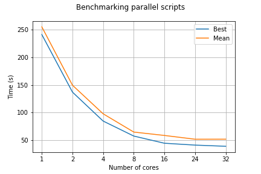

# Repo for working on the Cirrus HPC

## Important branches info!

Branch [master](https://github.com/ilsenatorov/cirrus_BIOC3301/tree/master) has all the data, including what was created outside cirrus, while branch [cirr_local](https://github.com/ilsenatorov/cirrus_BIOC3301/tree/cirr_local) can be cloned directly to the machine, since it only contains scripts that are run on the HPC. To clone only one branch, type:

`git clone -b cirr_local https://github.com/ilsenatorov/cirrus_BIOC3301.git`, which will create a folder with all the Cirrus scripts inside the folder. Remember that the scripts need to be run from home directory, so copy them using `cp <script to use> ~`

Another option is to fetch, using these commands in the home directory:
```
cd ~
git init
git add remote origin https://github.com/ilsenatorov/cirrus_BIOC3301.git
git pull origin cirr_local
```
This will out the scripts into the home directory on Cirrus

## How to use the scripts

run `bash <command_name>` from the terminal in the home directory (or where the fastq files are located)

### Commands available

#### get_core_logs.sh

Extracts the real run times from all the logs in the directory, together with the number of cores, puts them all in the times.log file in the current dir
Output looks like this:

```
Number of cores chosen is 1
real    4m2.500s
Number of cores chosen is 2
real    2m17.073s                                                                                                                   
Number of cores chosen is 4                                                                                                         
real    1m24.652s                                                                                                                   
Number of cores chosen is 8                                                                                                         
real    0m57.940s                                                                                                                   
Number of cores chosen is 16                                                                                                        
real    0m48.751s                                                                                                                   
Number of cores chosen is 24                                                                                                        
real    0m48.441s                                                                                                                   
Number of cores chosen is 32                                                                                                        
real    0m38.918s        
```

which can then be used to calculate [efficiency](.//benchmarks/Benchmark_efficiency.ipynb)

#### run_parall_benchm.sh

Runs the benchmarking script (parallel.cbs) with 1,2,4,8,16,24 and 32 cores

#### parallel.cbs

Measures time it took to run the qiime script pick_closed_reference_otus.py, takes the number of cores as the first positional argument.
_Example:_ `qsub -v "cores=4" parallel.cbs` will run the code with 4 cores

#### Other useful commands
* `rm _2017_cr_nojoin_no_golay_parallel.*` will remove all files that are created by benchmarking script (that start with _2017_cr_ etc)
* `rm -r otus*` will remove all the otus directories created by the script _make sure they don't have any important info!_

### .bashrc file

The [.bashrc](.//.bashrc) file is run every time you access the terminal on Cirrus, so you can put commands you need to run on start-up there. Additionally, aliases for commands that are used often can be created there

## Results

### Benchmarking

The [benchmarking Jupyter Notebook](.//benchmarks/Benchmark_efficiency.ipynb) calculates efficiency from the times of running a process on different cores, it takes data from [the csv file with times](.//benchmarks/parallel_benchmark.csv) and plots times and calculates efficiency, putting results into the [output csv file](./benchmarks/parallel_benchmark_output.csv).



### Locations

[Jupyter Notebook](./locations/location_plotter.ipynb) that takes data from the online spreadsheet and plots the locations where soil samples were taken onto a [Google Map](https://rawgit.com/ilsenatorov/cirrus_BIOC3301/master/locations/soil_samples_map.html).
