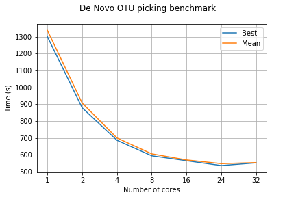

# Repo for working on the Cirrus HPC

<<<<<<< HEAD
## How to use the scripts
=======
## Important branches info!
>>>>>>> 0cf0e1486faf371cac726e2d832144540d0a4be9

Branch [master](https://github.com/ilsenatorov/cirrus_BIOC3301/tree/master) has all the data, including what was created outside cirrus, while branch [cirr_local](https://github.com/ilsenatorov/cirrus_BIOC3301/tree/cirr_local) can be cloned directly to the machine, since it only contains scripts that are run on the HPC. To clone only one branch, type:

<<<<<<< HEAD
## Commands available

### benchmark_script.sh
=======
`git clone -b cirr_local https://github.com/ilsenatorov/cirrus_BIOC3301.git`, which will create a folder with all the Cirrus scripts inside the folder. Remember that the scripts need to be run from home directory, so copy them using `cp <script to use> ~`

Another option is to fetch, using these commands in the home directory:
```
cd ~
git init
git add remote origin https://github.com/ilsenatorov/cirrus_BIOC3301.git
git pull origin cirr_local
```
This will out the scripts into the home directory on Cirrus

## How to use the scripts

run `bash <command_name>` from the terminal in the home directory (or where the fastq files are located)
>>>>>>> 0cf0e1486faf371cac726e2d832144540d0a4be9

runs a script with diffeent number of cores. Takes the location of the script to test as first positional argument - `./benchmark_script.sh <script to benchmark>`. Make sure that <script to benchmark> is using a truncated dataset, for example __seqs_500k.fna__ instead of __seqs.fna__. 

<<<<<<< HEAD
### get_logs.sh
=======
#### get_core_logs.sh
>>>>>>> 0cf0e1486faf371cac726e2d832144540d0a4be9

Collects all the logs created by __benchmark_script.sh__ and creates a logfile from them. Takes the names of logfiles without the extensions but with the dot, for example `./get_logs.sh my_benchmarking_logs.`. __Won't work without the dot at the end!__

## Scripts folder

<<<<<<< HEAD
Has the scripts I used for working with the dataset, the ones that start with and underscore _ are unfinished. Has a useful pbs_template which has the parts of script that should be present in all PBS scripts.
=======
which can then be used to calculate [efficiency](.//benchmarks/Benchmark_efficiency.ipynb)

#### run_parall_benchm.sh

Runs the benchmarking script (parallel.cbs) with 1,2,4,8,16,24 and 32 cores

#### parallel.cbs

Measures time it took to run the qiime script pick_closed_reference_otus.py, takes the number of cores as the first positional argument.
_Example:_ `qsub -v "cores=4" parallel.cbs` will run the code with 4 cores


### .bashrc file

The [.bashrc](.//.bashrc) file is run every time you access the terminal on Cirrus, so you can put commands you need to run on start-up there. Additionally, aliases for commands that are used often can be created there

## Results

### Benchmarking

The [benchmarking Jupyter Notebook](./benchmarks/Benchmark_efficiency.ipynb) calculates efficiency from the times of running a process on different cores, it takes data from [the csv file with times](./benchmarks/closed_otus.csv) and plots times and calculates efficiency, putting results into the [output csv file](./benchmarks/closed_otus_out.csv).

It uses the module __bench_module.py__, which is located in the same directory, but can be used on its own.

##### Picking closed otus benchmarking plot


##### Picking de novo otus benchmarking plot



### Locations

[Jupyter Notebook](./locations/location_plotter.ipynb) that takes data from the online spreadsheet and plots the locations where soil samples were taken onto a [Google Map](./locations/soil_samples_map.html). However, to view the map propely, you need to download an open it first.
>>>>>>> 0cf0e1486faf371cac726e2d832144540d0a4be9
