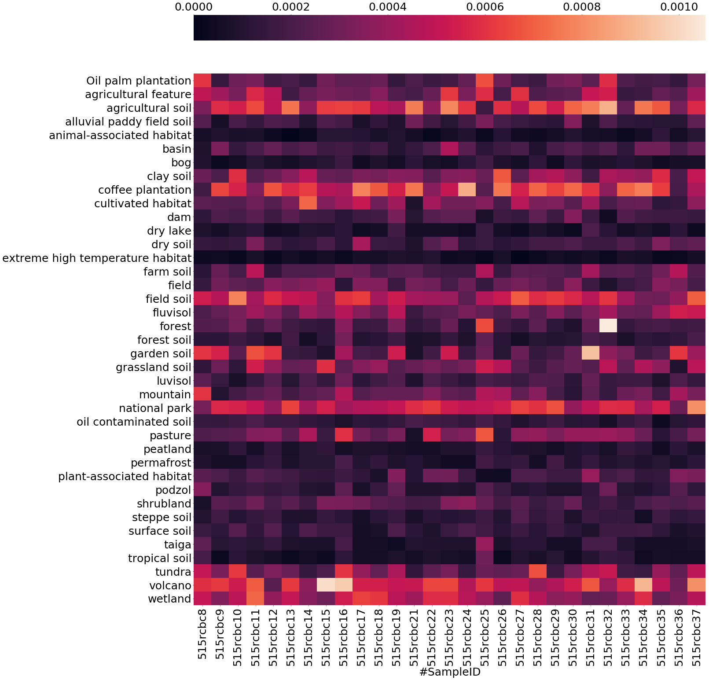
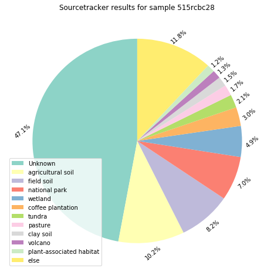
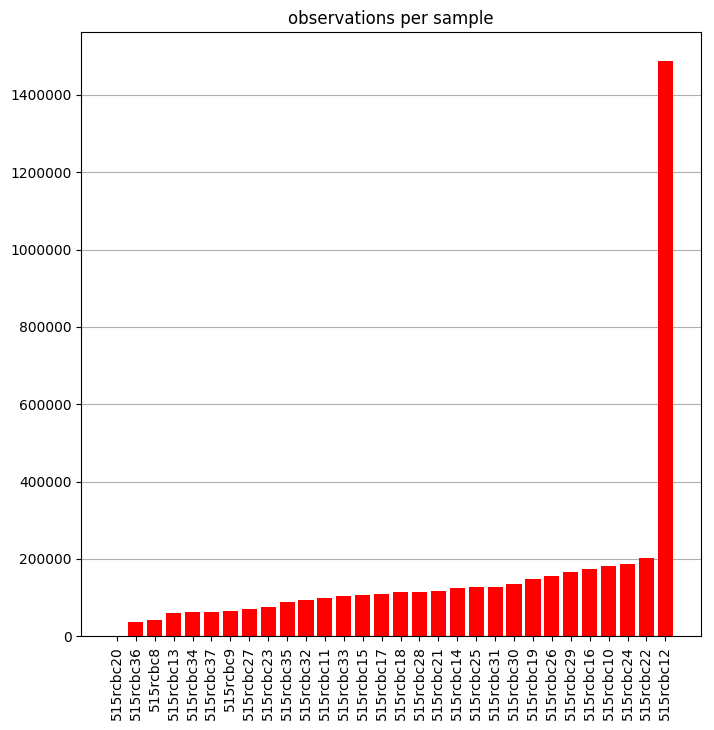
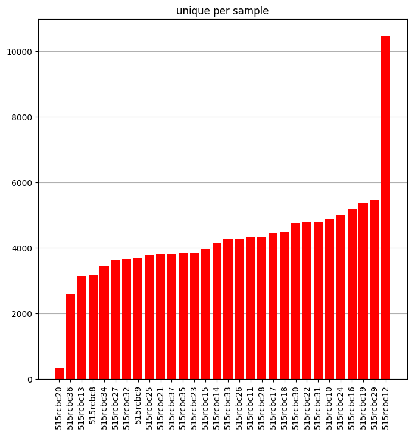
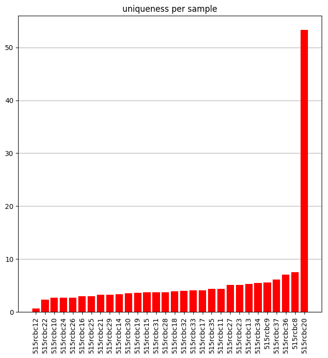

# Repo for working on the Cirrus HPC

## Important branches info!

Branch [master](https://github.com/ilsenatorov/cirrus_BIOC3301/tree/master) has all the data, including what was created outside cirrus, while branch [cirr_local](https://github.com/ilsenatorov/cirrus_BIOC3301/tree/cirr_local) can be cloned directly to the machine, since it only contains scripts that are run on the HPC. To clone only one branch, type:

`git clone -b cirr_local https://github.com/ilsenatorov/cirrus_BIOC3301.git`, which will create a folder with all the Cirrus scripts inside the folder. Remember that the scripts need to be run from home directory, so copy them using `cp <script to use> ~`

Another option is to fetch, using these commands in the home directory:
```
cd ~
git init
git add remote origin https://github.com/ilsenatorov/cirrus_BIOC3301.git
git pull origin cirr_local
```
This will put the scripts into the home directory on Cirrus
***
## Commands available

### benchmark_script.sh

runs a script with diffeent number of cores. Takes the location of the script to test as first positional argument - `./benchmark_script.sh <script to benchmark>`. Make sure that the _pbs script_ is using a truncated dataset, for example __seqs_500k.fna__ instead of __seqs.fna__.

#### get_logs.sh

Collects all the logs created by __benchmark_script.sh__ and creates a logfile from them. Takes the names of logfiles without the extensions but with the dot, for example `./get_logs.sh my_benchmarking_logs.`. __Won't work without the dot at the end!__

## Scripts folder

Has the scripts I used for working with the dataset, the ones that start with and underscore _ are unfinished. Has a useful pbs_template which has the parts of script that should be present in all PBS scripts.
***
## Results

### Benchmarking

The [benchmarking Jupyter Notebook](./benchmarks/Benchmark_efficiency.ipynb) calculates efficiency from the times of running a process on different cores. More info in the folder's [README](./benchmarking/)

***
### Locations

[Jupyter Notebook](./locations/location_plotter.ipynb) that takes data from the mapping files and plots the locations where soil samples were taken onto a Google map. However, due to some bugs they only work for the machine they were produced on, so in order to get the map you will need to run the notebook. The notebook uses the [map_plotter.py](./locations/map_plotter.py) module, gmplot, numpy and pandas, and expects the mapping files in csv form in the directory.
***
### Sourcetracker

[Jupyter Notebook](./sourcetracker/sourcetracker.ipynb) takes data from the results of sourcetracker script, and plots graphs from them.

#### Sourcetracker heatmap (percentage)


#### Sourcetracker heatmap (standard deviation)



#### Sourcetracker pie chart (for one sample, percentage)


***
### Uniqueness

[This notebook](./qualitative/uniqueness.ipynb) takes a look at how unique each sample is and plots it.

#### Number of observations



#### Number of unique otus



#### Uniqueness (Total observed/unique observed)


