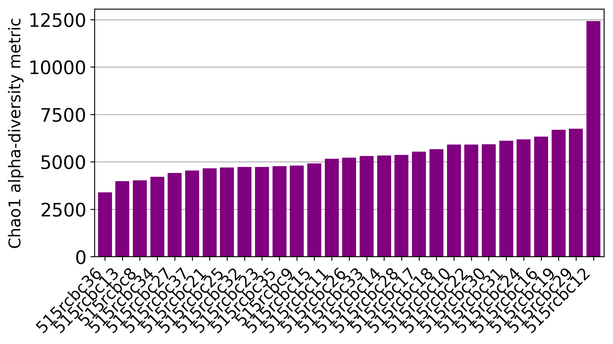
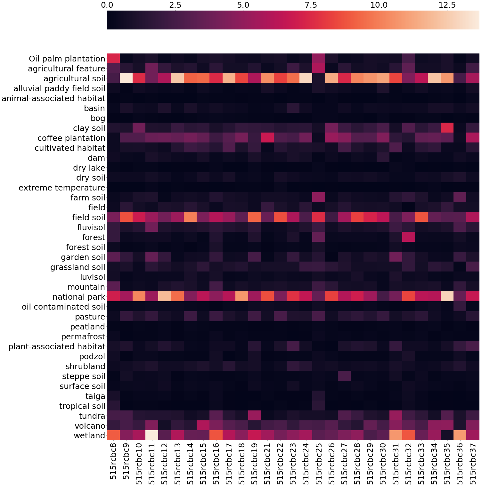
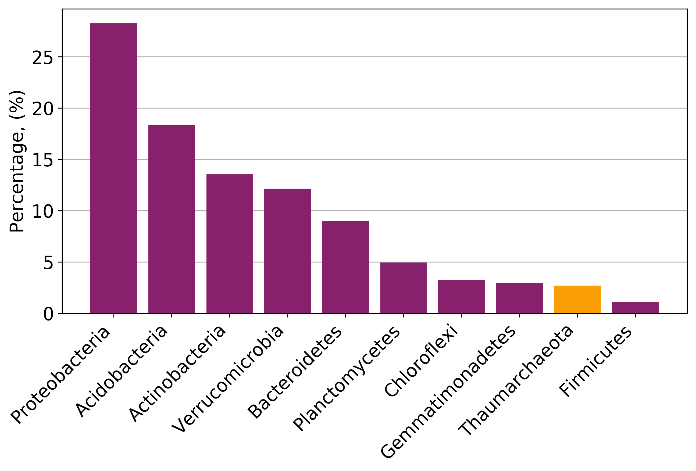

# Repo for working on the Cirrus HPC

## Introduction

This repository covers 2 main aspects of microbiome analysis. It has the scripts that were used on the Cirrus HPC to get the data, located in the [scripts](./scripts/) folder, and the jupyter notebooks used to create the figures from such data, coupled with the figures themself. There is also the benchmarking folder, which contains caclulation for optimal number of cores and folders with other analysis.

## Worklog

The [worklog.md](worklog.md) file contains information on which scripts were run on the HPC and the time, output for each.

## Scripts folder

Has the scripts that were used in the basic pipeline of OTU picking, sequence alignment, core diveristy analysis and sourcetracker scripts. Scripts with .pbs extension were submitted to the Cirrus HPC, while others were run locally.

## Data analyses scripts

### Alpha, beta diversities and else

Contains the majority of the analyses performed, with the [jupyter notebook](./analyses/analyses.ipynb) that was used to create majority of the plots as well as some data.
#### Chao1 alpha-diversity

#### Unweighted unifrac beta-diversity

***

### Sourcetracker

[Jupyter Notebook](./sourcetracker/sourcetracker.ipynb) takes data from the results of sourcetracker script, and plots graphs from them.

#### Sourcetracker heatmap (no 'Unknown')

***
### Uniqueness

[This notebook](./qualitative/uniqueness.ipynb) takes a look at how unique each sample is and plots it.

#### Uniqueness

***
### Taxonomy

[Jupyter notebook](./taxonomy/taxa.ipynb) that was used to plot most of the taxonomy-related figures.

#### Top 10 most abundant phyla (only archea in green)

## Meta calculations and plots

### Locations

[Jupyter Notebook](./locations/location_plotter.ipynb) that takes data from the mapping files and plots the locations where soil samples were taken onto a Google map. However, due to some bugs they only work for the machine they were produced on, so in order to get the map you will need to run the notebook. The notebook uses the [map_plotter.py](./locations/map_plotter.py) module, gmplot, numpy and pandas, and expects the mapping files in csv form in the directory.
***
### Benchmarking

The [benchmarking Jupyter Notebook](./benchmarks/Benchmark_efficiency.ipynb) calculates efficiency from the times of running a process on different cores. More info in the folder's [README](./benchmarking/)

