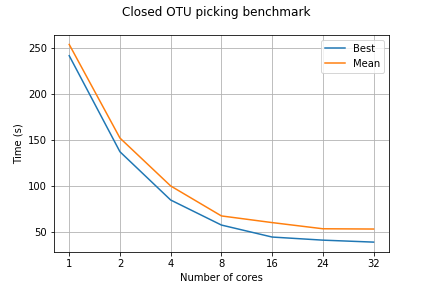
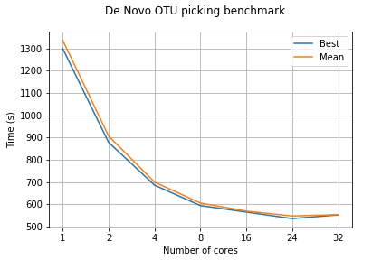
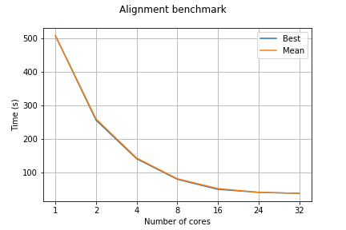

## Benchmarking results

This [benchmarking Jupyter Notebook](./Benchmark_efficiency.ipynb) calculates efficiency from the times of running a process on different cores, it takes data from [the csv file with times](./closed_otus.csv) and plots times and calculates efficiency, putting results into the [output csv file](./closed_otus_out.csv).

It uses the module __bench_module.py__, which is located in the same directory, but can be used on its own.

##### Picking closed otus benchmarking plot

##### Picking de novo otus benchmarking plot

##### Alignment benchmarking plots

