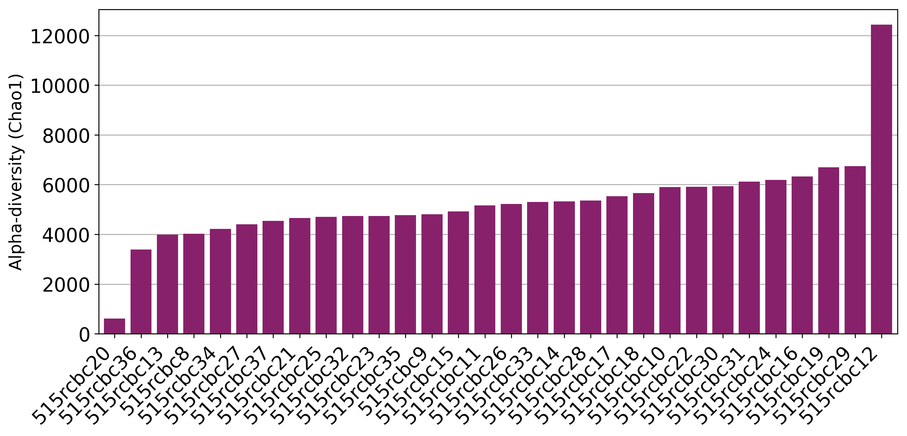
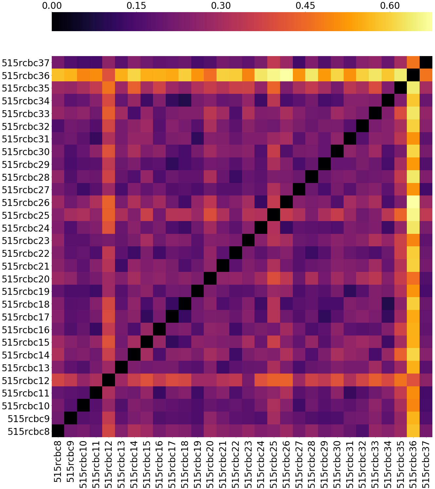
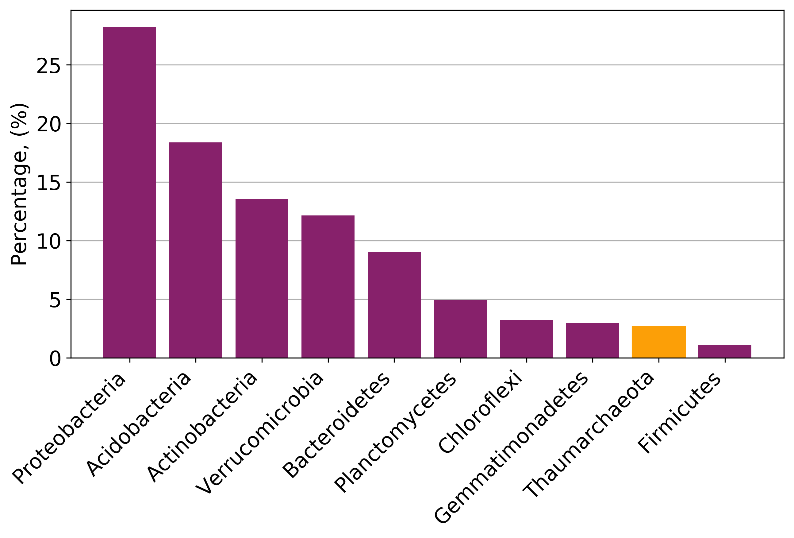
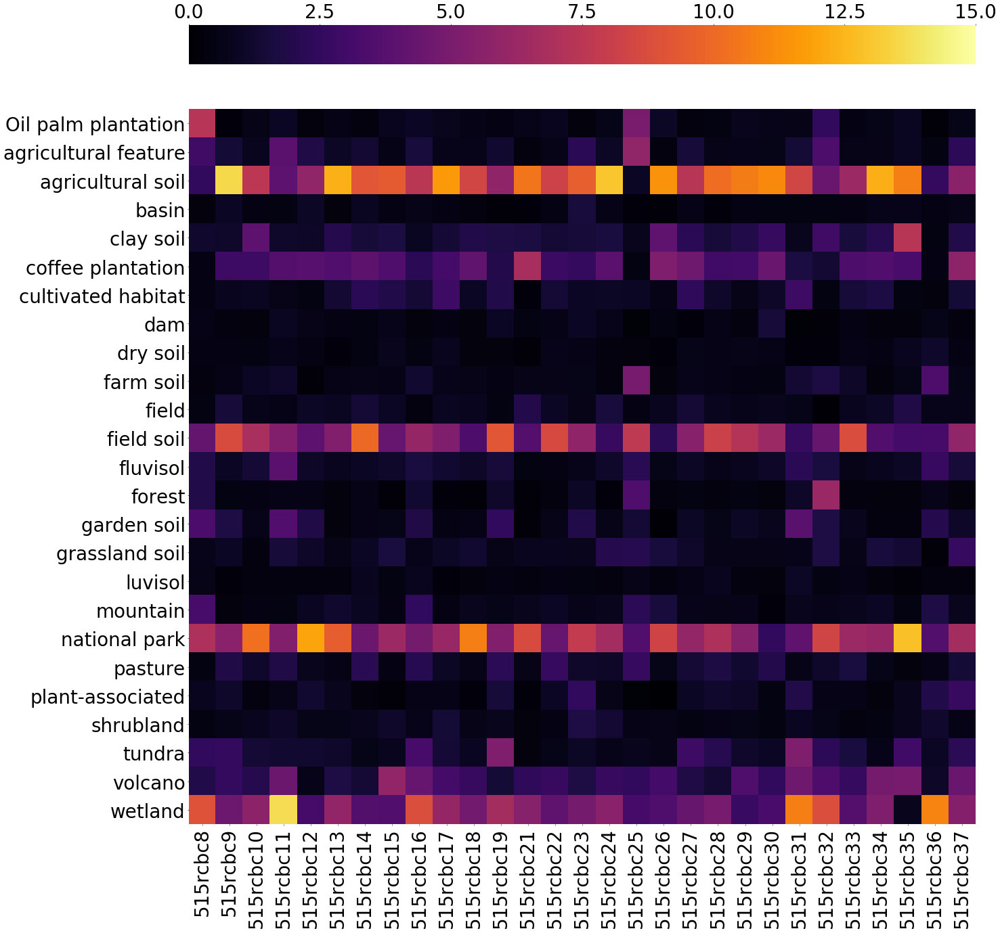

# Report

## Notebook

Figures that will be used in the final report are all generated in one jupyter notbook - [figures.ipynb](figures.ipynb).
***
#### Alpha diversity

***
#### Beta diversity

***

#### Taxonomy

***

#### Sourcetracker

## LATEX

Final report is written in latex
